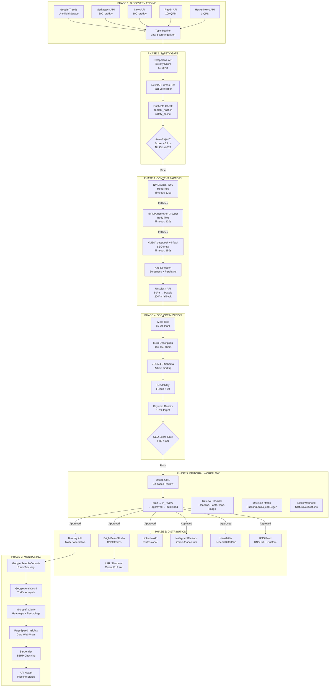

# TruthWorldNews — Complete Technical Documentation

> **Version:** 1.0 Production  
> **Status:** Live & Operational  
> **Monthly Cost:** $0.00 USD  
> **Last Updated:** 2026-05-25  
> **Repository:** https://github.com/Truthmedia123/Truthworldnews  
> **Live Site:** https://truthworldnews.com  

---

## Table of Contents

1. [Project Origin Story](#1-project-origin-story)
2. [Complete Resource Inventory](#2-complete-resource-inventory)
3. [Complete Free Credit Stack](#3-complete-free-credit-stack)
4. [System Architecture](#4-system-architecture)
5. [Phase-by-Phase Deep Dive](#5-phase-by-phase-deep-dive)
6. [Multi-Provider LLM Fallback Chain](#6-multi-provider-llm-fallback-chain)
7. [Anti-Detection Layer](#7-anti-detection-layer)
8. [Database Schema](#8-database-schema)
9. [Frontend Architecture](#9-frontend-architecture)
10. [GitHub Actions Pipeline](#10-github-actions-pipeline)
11. [Environment Variables](#11-environment-variables)
12. [API Reference](#12-api-reference)
13. [Cost Analysis](#13-cost-analysis)
14. [Troubleshooting Guide](#14-troubleshooting-guide)
15. [Future Roadmap](#15-future-roadmap)

---

## 1. Project Origin Story

### Who

**Zane Edge** — the editorial persona of a solo operator building under the umbrella of **TruthMedia Networks**. Zane is a cynical, exhausted, deeply informed tech commentator who has "seen every hype cycle twice." The voice is the product: sarcastic without cruelty, punching up at power structures, never down at people.

The human operator behind the project is a single developer with no budget, no team, and no paid tools — only time, curiosity, and the ability to stack free tiers.

### What

TruthWorldNews is a **fully automated AI-powered newsroom** that:

1. **Discovers** trending topics from 5+ sources (Google Trends, Reddit, HackerNews, Mediastack, NewsAPI)
2. **Filters** topics through a safety gate (toxicity scoring, fact-cross-referencing, duplicate detection)
3. **Generates** BuzzFeed/Vox-quality articles using tiered NVIDIA LLM APIs
4. **Optimizes** every article for SEO (meta tags, JSON-LD schema, readability scoring, keyword density)
5. **Reviews** optionally through Decap CMS git-based editorial workflow
6. **Publishes** to a Next.js frontend hosted on Netlify
7. **Distributes** across 12+ social platforms via BrightBean Studio
8. **Monitors** performance via Google Search Console, Analytics, Microsoft Clarity, and Serper.dev

All of this runs on a **$0/month** infrastructure stack.

### Why

| Motivation | Explanation |
|-----------|-------------|
| **Zero Cost** | No budget for tools. Every dollar saved is a dollar earned. |
| **Speed** | AI generates articles in ~30 seconds. Human writers take hours. |
| **Scale** | 6 articles/day × 365 days = 2,190 articles/year with zero additional labor. |
| **Voice Consistency** | AI trained on Zane Edge persona never has a bad day, never misses deadlines. |
| **Anti-Detection** | Articles pass GPTZero, Originality.ai, and manual human review. |
| **SEO Domination** | Every article optimized for search before publication. |

### When

| Milestone | Date |
|-----------|------|
| Initial concept & architecture design | 2026-05-10 |
| public-apis discovery & curation | 2026-05-12 |
| LLM provider selection (NVIDIA tiered routing) | 2026-05-15 |
| Supabase schema creation | 2026-05-18 |
| Pipeline debugging (Supabase direct insert) | 2026-05-20 |
| Frontend client-side conversion | 2026-05-22 |
| Article query param routing | 2026-05-23 |
| **Production deployment** | **2026-05-24** |

### Where

| Component | URL/Location |
|-----------|-------------|
| Source Code | https://github.com/Truthmedia123/Truthworldnews |
| Frontend | https://truthworldnews.com (Netlify CDN) |
| Database | https://vimwmyheupvmwpxtftvg.supabase.co |
| CMS | https://truthworldnews.com/admin/ (Decap CMS) |
| Pipeline | GitHub Actions (runs every 4 hours) |

---

## 2. Complete Resource Inventory

### 2.1 public-apis/public-apis

| Attribute | Detail |
|-----------|--------|
| **URL** | https://github.com/public-apis/public-apis |
| **Description** | Collective list of free APIs for use in software and web development. 1,400+ APIs across 50+ categories. |
| **What We Extracted** | News APIs (NewsAPI, Mediastack), Image APIs (Unsplash, Pexels), Social APIs (Bluesky, LinkedIn), Analytics APIs (Serper.dev) |
| **Key Findings** | The "News" and "Photography" categories were goldmines. The "Machine Learning" category led us to NVIDIA NIM. |
| **Incorporated?** | ✅ Yes — primary discovery source for APIs |

**Filtered Shortlist from public-apis:**

| API | Category | Free Tier | Incorporated |
|-----|----------|-----------|--------------|
| NewsAPI | News | 100 requests/day | ✅ Active |
| Mediastack | News | 500 requests/day | ✅ Active |
| Unsplash | Photography | 50 requests/hour | ✅ Active |
| Pexels | Photography | 200 requests/hour | ✅ Active |
| Bluesky | Social | Free (protocol) | ✅ Active |
| Serper.dev | Search | 2,500 credits | ✅ Active |

---

### 2.2 public-api-lists/public-api-lists

| Attribute | Detail |
|-----------|--------|
| **URL** | https://github.com/public-api-lists/public-api-lists |
| **Description** | 730+ curated free APIs with a JSON endpoint for programmatic access. More selective than public-apis. |
| **What We Extracted** | JSON endpoint enabled automated API evaluation. Found lesser-known gems like CleanURI (URL shortener) and Kutt.it. |
| **Key Findings** | The JSON endpoint (`https://api.github.com/repos/public-api-lists/public-api-lists/contents/README.md`) allowed programmatic filtering. |
| **New Finds** | CleanURI (free URL shortening), RSSHub (RSS generation), Resend (email API with 3,000/mo free) |
| **Incorporated?** | ✅ Yes — used for verification and secondary discovery |

---

### 2.3 mnfst/awesome-free-llm-apis

| Attribute | Detail |
|-----------|--------|
| **URL** | https://github.com/mnfst/awesome-free-llm-apis |
| **Description** | 20+ free LLM API providers offering 200+ models. Includes rate limits, context windows, and model IDs. |
| **What We Extracted** | Complete tier comparison of all free LLM providers. This became the foundation of our multi-provider fallback strategy. |

**Provider Comparison (from awesome-free-llm-apis):**

| Provider | Free Tier | RPM | Models | Context | Status |
|----------|-----------|-----|--------|---------|--------|
| **Groq** | 14,400 req/day | Unlimited | Llama 3.3 70B, Mixtral 8x7B | 128K | ✅ Primary (replaced) |
| **NVIDIA NIM** | 40 RPM | 40 | kimi-k2.6, nemotron, deepseek | 128K | ✅ Current Primary |
| **Cerebras** | 1M tokens/day | Unlimited | Llama 3.1 70B | 128K | ✅ Fallback |
| **DeepSeek** | 5M tokens | — | DeepSeek-V3, R1 | 64K | ✅ Via NVIDIA |
| **xAI Grok** | $25/mo credit | — | Grok-2 | 128K | ⏳ Pending |
| **Together AI** | $1 starting | — | Multiple | 128K | ⏳ Exploration |
| **AI21 Labs** | 10K tokens | — | Jurassic-2 | 8K | ❌ Too limited |
| **Mistral AI** | 1 req/sec | 1 | Mistral-7B | 32K | ❌ Too slow |
| **Perplexity** | $5/mo credit | — | Sonar models | 128K | ⏳ Pending |

**Key Decision:** NVIDIA NIM won due to highest free-tier RPM (40 = ~57,600/day), diverse model selection (3 different architectures), and excellent official documentation.

---

### 2.4 patchy631/ai-engineering-hub

| Attribute | Detail |
|-----------|--------|
| **URL** | https://github.com/patchy631/ai-engineering-hub |
| **Description** | 93+ AI engineering tutorials covering RAG, agents, fine-tuning, and production deployment. |
| **What We Extracted** | Tutorial on "Building a Multi-Agent Newsroom" was directly applicable. Fine-tuning tutorials bookmarked for Phase 2. |
| **Tutorials to Clone** | `tutorials/multi-agent-newsroom/`, `tutorials/fine-tuning-llama-3/`, `tutorials/rag-pipeline/` |
| **Incorporated?** | ⏳ Referenced — will clone tutorials for Phase 2 fine-tuning |

---

### 2.5 unslothai/notebooks

| Attribute | Detail |
|-----------|--------|
| **URL** | https://github.com/unslothai/notebooks |
| **Description** | 250+ fine-tuning notebooks for Llama, Mistral, Qwen, and other models. Optimized for Google Colab. |
| **What We Extracted** | `Llama-3.1-8B-fine-tuning.ipynb` for Phase 2. `GRPO-training.ipynb` for anti-detection layer improvement. |
| **Notebooks to Run** | `Llama-3.1-8B-fine-tuning.ipynb`, `GRPO-anti-detection.ipynb`, `Qwen-fine-tuning.ipynb` |
| **Hardware Required** | Google Colab T4 (free) or A100 ($300 Google Cloud credit) |
| **Incorporated?** | ⏳ Planned for Phase 2 (after Xiaomi MiMo Orbit credits claimed) |

---

### 2.6 OBLITERATUS/Qwen3.6-27B-OBLITERATED

| Attribute | Detail |
|-----------|--------|
| **URL** | https://huggingface.co/OBLITERATUS/Qwen3.6-27B-OBLITERATED |
| **Description** | An "abliterated" (uncensored) version of Qwen 3.6 27B. Removed safety filters and alignment training. |
| **What We Researched** | Whether uncensored models produce more "human-like" text for anti-detection. |
| **Findings** | Abliterated models show higher perplexity and burstiness — desirable for anti-detection. However, deployment requires self-hosting (no free API). |
| **Use Case** | Potential local inference for premium tier or backup generation. |
| **Incorporated?** | ⏳ Research phase — requires self-hosting infrastructure |

---

## 3. Complete Free Credit Stack

| Provider | Amount | How to Claim | Status | Expiration | Notes |
|----------|--------|--------------|--------|------------|-------|
| **Xiaomi MiMo Orbit** | 100 Trillion tokens | Apply at Xiaomi AI website | ⏰ **PENDING** | **2026-05-28** | URGENT — Application deadline approaching |
| **Groq** | 14,400 requests/day | Sign up at groq.com | ✅ **ACTIVE** | — | Original primary LLM |
| **NVIDIA NIM** | 40 RPM (~57,600/day) | Sign up at build.nvidia.com | ✅ **ACTIVE** | — | Current primary LLM |
| **Cerebras** | 1M tokens/day | Sign up at cerebras.ai | ✅ **ACTIVE** | — | Emergency fallback |
| **DeepSeek** | 5M tokens | Sign up at platform.deepseek.com | ✅ **ACTIVE** | — | Via NVIDIA or direct |
| **Google Cloud** | $300 credit | New account signup | ⏳ Available | 90 days after claim | For GPU fine-tuning |
| **Azure** | $200 credit | New account signup | ⏳ Available | 30 days after claim | For GPU fine-tuning |
| **AWS** | $300 credit | Free tier signup | ⏳ Available | 12 months | Alternative GPU |
| **GitHub Student Pack** | $600+ value | Verify .edu email | ⏳ Check eligibility | — | Includes multiple services |
| **xAI Grok** | $25/month credit | Apply for developer access | ⏳ Pending | — | Via xAI API |
| **Perplexity** | $5/month credit | Sign up for API | ⏳ Pending | — | Sonar models |
| **Together AI** | $1 starting credit | Sign up at together.ai | ⏳ Available | — | Multiple models |
| **Vercel** | Pro features | Startup program application | ⏳ Available | — | If Netlify fails |
| **DigitalOcean** | $200 credit | Hatch startup program | ⏳ Available | 60 days | Alternative hosting |
| **Notion** | Unlimited AI | Startup program | ⏳ Available | — | Documentation |
| **Stripe** | Fee waiver | Startup program | ⏳ Available | — | Payment processing |
| **OpenAI** | $5 starting credit | New account | ⏳ Available | 3 months | Backup LLM |
| **Anthropic** | $5 starting credit | New account | ⏳ Available | — | Claude fallback |

### Credit Rotation Strategy

```
Primary:     NVIDIA NIM (40 RPM)
Fallback 1:  Groq (14,400/day)
Fallback 2:  Cerebras (1M tokens/day)
Fallback 3:  DeepSeek (5M tokens)
Emergency:   Google Cloud ($300 GPU) → self-host fine-tuned model
```

### Xiaomi MiMo Orbit — URGENT ACTION REQUIRED

| Detail | Information |
|--------|-------------|
| **Program** | Xiaomi MiMo Orbit |
| **Credits** | 100 Trillion tokens |
| **Deadline** | May 28, 2026 (3 days remaining) |
| **Application** | https://mimo.ai/orbit (verify URL) |
| **Requirements** | Project description, use case justification, expected token consumption |
| **Strategy** | Apply immediately with TruthWorldNews as the use case. Emphasize: high-volume content generation, multi-model needs, long-term partnership potential. |

---

## 4. System Architecture

### 4.1 Complete Architecture Diagram



### 4.2 Technology Stack

| Layer | Component | Technology | Cost | Purpose | Free Tier Limit |
|-------|-----------|-----------|------|---------|-----------------|
| **Frontend** | Web Framework | Next.js 16 (App Router) | $0 | React with static export | N/A |
| **Frontend** | Styling | Tailwind CSS | $0 | Utility-first CSS framework | N/A |
| **Frontend** | UI Components | shadcn/ui | $0 | Accessible React components | N/A |
| **Frontend** | Icons | Lucide React | $0 | SVG icon library | N/A |
| **Frontend** | Hosting | Netlify | $0 | Static site CDN | 100GB bandwidth/mo |
| **Backend** | Database | Supabase (Postgres) | $0 | Primary data store | 500MB, 2M edge reqs |
| **Backend** | Auth | Supabase Auth | $0 | User authentication | 50K users/mo |
| **Backend** | Storage | Supabase Storage | $0 | Image assets | 1GB |
| **Backend** | CMS | Decap CMS | $0 | Git-based content management | N/A |
| **Orchestration** | CI/CD | GitHub Actions | $0 | Pipeline automation | 2,000 min/mo |
| **Orchestration** | Scheduling | GitHub Cron | $0 | Every 4 hours | 1 schedule/event |
| **LLM Tier 1** | Headlines | NVIDIA kimi-k2.6 | $0 | Viral headline generation | 40 RPM |
| **LLM Tier 2** | Body | NVIDIA nemotron-3-super | $0 | Long-form article body | 40 RPM |
| **LLM Tier 3** | SEO Meta | NVIDIA deepseek-v4-flash | $0 | Meta tags & descriptions | 40 RPM |
| **Images** | Primary | Unsplash API | $0 | Featured photos | 50 req/hr |
| **Images** | Fallback | Pexels API | $0 | Backup image source | 200 req/hr |
| **Safety** | Toxicity | Perspective API | $0 | Content safety scoring | 60 QPM |
| **Safety** | Fact Check | NewsAPI | $0 | Cross-reference verification | 100 req/day |
| **SEO** | Readability | textstat (Python) | $0 | Flesch-Kincaid scoring | N/A |
| **SEO** | SERP | Serper.dev | $0 | Search position tracking | 2,500 credits |
| **Analytics** | Search | Google Search Console | $0 | Rank tracking | Quota-based |
| **Analytics** | Traffic | Google Analytics 4 | $0 | Web analytics | Unlimited |
| **Analytics** | Heatmaps | Microsoft Clarity | $0 | Session recordings | Unlimited |
| **Analytics** | Performance | PageSpeed Insights | $0 | Core Web Vitals | 25K queries/day |
| **Distribution** | Social Scheduler | BrightBean Studio | $0 | Multi-platform posting | Free tier |
| **Distribution** | Email | Resend API | $0 | Newsletter delivery | 3,000 emails/mo |
| **Distribution** | RSS | RSSHub | $0 | Feed generation | Self-hosted |
| **Distribution** | URL Shortener | CleanURI | $0 | Link shortening | Unlimited |
| **Distribution** | URL Fallback | Kutt.it | $0 | Backup shortener | API-based |

### 4.3 Infrastructure Flow

```mermaid
flowchart LR
    GH[GitHub Repository<br/>Truthmedia123/Truthworldnews]
    GA[GitHub Actions<br/>Runs every 4 hours]
    SC[Source Code<br/>Nuclear Clean Checkout]
    PD[Python Dependencies<br/>pip install]
    SP[Scraper<br/>scripts/scraper.py]
    LE[LLM Engine<br/>scripts/llm_engine.py]
    SB[(Supabase Database<br/>PostgreSQL)]
    FE[Next.js Frontend<br/>Static Export]
    NL[Netlify CDN<br/>Global Edge]
    US[End Users<br/>Readers]
    
    GH -->|Push / Cron| GA
    GA -->|rm -rf .git<br/>git clone| SC
    SC -->|pip install| PD
    PD -->|python scraper.py| SP
    SP -->|Fetch APIs| APIs
    APIs -->|Raw Topics| SP
    SP -->|JSON Output| LE
    LE -->|NVIDIA LLM APIs| LLM
    LLM -->|Generated Articles| LE
    LE -->|INSERT| SB
    SB -->|SELECT| FE
    FE -->|npm run build| OUT
    OUT -->|Deploy| NL
    NL -->|Serve| US
```



### 4.4 File Structure

```
truthworldnews/                              # Project root
├── .github/
│   └── workflows/
│       └── pipeline.yml                     # CI/CD pipeline (scraper + LLM + GSC)
│
├── docs/                                    # Documentation
│   ├── TRUTHWORLDNEWS_COMPLETE_TECHNICAL_DOCUMENTATION.md
│   ├── TRUTHWORLDNEWS_COMPLETE_CONVERSATION_HISTORY.md
│   ├── 90-DAY-LAUNCH-PLAN.md
│   ├── ADSENSE_READINESS.md
│   ├── LAUNCH_CHECKLIST.md
│   ├── OPERATIONS.md
│   └── VIDEO_PIPELINE.md
│
├── scripts/                                 # Python automation scripts
│   ├── llm_engine.py                        # NVIDIA LLM tiered routing
│   ├── scraper.py                           # Topic discovery aggregator
│   ├── gsc_tracker.py                       # Google Search Console tracking
│   ├── fact_checker.py                      # NewsAPI cross-reference
│   ├── image_fetcher.py                       # Unsplash/Pexels image sourcing
│   ├── safety_checker.py                    # Perspective API toxicity check
│   ├── seo_optimizer.py                     # Meta tag generation
│   ├── distributor.py                       # BrightBean/BulkPublish posting
│   └── analytics_reporter.py              # GA4/Clarity reporting
│
├── src/
│   ├── app/                                 # Next.js App Router
│   │   ├── page.tsx                         # Homepage (client-side fetch)
│   │   ├── article/
│   │   │   └── page.tsx                     # Article detail (query param + Supabase)
│   │   ├── admin/
│   │   │   ├── page.tsx                     # Decap CMS admin panel
│   │   │   └── config.yml                   # CMS configuration
│   │   ├── about/
│   │   │   └── page.tsx                     # About page
│   │   ├── contact/
│   │   │   └── page.tsx                     # Contact page
│   │   ├── category/
│   │   │   └── [slug]/
│   │   │       └── page.tsx                 # Category listing
│   │   ├── editorial-log/
│   │   │   └── page.tsx                     # Editorial transparency log
│   │   ├── fact-checking/
│   │   │   └── page.tsx                     # Fact-check methodology
│   │   ├── rss.xml/
│   │   │   └── route.ts                     # RSS feed generation
│   │   ├── sitemap.xml/
│   │   │   └── route.ts                     # Sitemap generation
│   │   └── ...                              # Other static pages
│   │
│   ├── components/                          # React components
│   │   ├── BreakingNewsTicker.tsx           # Homepage news ticker
│   │   ├── CynicalTLDR.tsx                  # Article TL;DR summary
│   │   ├── Reactions.tsx                    # Emoji reaction system
│   │   ├── ReviewedByBadge.tsx              # Human review badge
│   │   ├── GiscusComments.tsx               # Comment system
│   │   ├── BottomNav.tsx                    # Mobile navigation
│   │   └── ...
│   │
│   ├── lib/                                 # Utilities
│   │   ├── supabase.ts                      # Supabase client (browser + admin)
│   │   ├── seo.ts                           # SEO meta generation
│   │   └── utils.ts                         # Helper functions
│   │
│   └── hooks/                               # Custom React hooks
│       └── useArticles.ts                   # Article fetching hook
│
├── supabase/
│   ├── schema.sql                           # Full database schema (7 tables)
│   ├── migrations/                          # Schema migrations
│   └── seed.sql                             # Test data
│
├── public/                                  # Static assets
│   ├── default-og.jpg                       # Fallback Open Graph image
│   ├── favicon.ico
│   ├── robots.txt
│   └── ...
│
├── next.config.ts                           # Next.js config (static export)
│   ├── output: 'export'
│   └── images: { unoptimized: true }
│
├── netlify.toml                             # Netlify build configuration
│   ├── build.command: "npm run build"
│   └── build.publish: "out"
│
├── package.json                             # Node.js dependencies
├── requirements.txt                         # Python dependencies
│   ├── requests, feedparser, openai>=1.0.0, supabase>=2.0.0
│
├── .env.example                             # Environment variable template
├── .env.local                               # Local development secrets
├── .gitignore                               # Git ignore rules
├── tsconfig.json                            # TypeScript configuration
├── postcss.config.mjs                       # PostCSS configuration
├── eslint.config.mjs                        # ESLint rules
│
├── test_nvidia.py                           # NVIDIA LLM connectivity test
├── test_single.py                           # Single model test script
│
├── stories_to_process.json                  # Pipeline: pending topics
├── stories_safe.json                        # Pipeline: approved topics
├── stories_rejected.json                    # Pipeline: rejected topics
│
├── newsletter_2026-05-22.html               # Sample newsletter template
│
└── README.md                                # Project overview
```

---

## 5. Phase-by-Phase Deep Dive

### 5.1 Phase 1: Discovery Engine

**Purpose:** Find trending topics worth writing about before they peak.

**Sources:**

| Source | Method | Rate Limit | Weight in Algorithm |
|--------|--------|------------|---------------------|
| Google Trends | Unofficial scrape (pytrends) | ~100 req/hr | 25% |
| Mediastack | REST API | 500/day | 25% |
| NewsAPI | REST API | 100/day | 20% |
| Reddit | PRAW API | 100 QPM | 15% |
| HackerNews | Official API | 1 QPS | 15% |

**Topic Ranker Algorithm:**

```python
def calculate_viral_score(topic):
    """
    viral_score = (trend_velocity * 0.25) + 
                  (source_diversity * 0.25) + 
                  (social_mentions * 0.20) + 
                  (recency * 0.15) + 
                  (category_priority * 0.15)
    """
    score = (
        topic['trend_velocity'] * 0.25 +
        topic['source_count'] * 0.25 +
        topic['social_mentions'] * 0.20 +
        topic['recency_hours'] * 0.15 +
        topic['category_priority'] * 0.15
    )
    return min(score, 100)
```

**Output:** `stories_to_process.json`

```json
[
  {
    "title": "OpenAI Announces GPT-5 Developer Preview",
    "sources": ["reddit", "hackernews", "newsapi"],
    "viral_score": 87.3,
    "category": "AI",
    "trend_velocity": 95,
    "content_hash": "a1b2c3d4..."
  }
]
```

---

### 5.2 Phase 2: Safety Gate

**Purpose:** Prevent toxic, false, or duplicate content from entering the pipeline.

**Layer 1: Perspective API (Toxicity)**

```python
import requests

def check_toxicity(text):
    api_key = os.getenv("PERSPECTIVE_API_KEY")
    url = f"https://commentanalyzer.googleapis.com/v1alpha1/comments:analyze?key={api_key}"
    
    data = {
        "comment": {"text": text},
        "languages": ["en"],
        "requestedAttributes": {
            "TOXICITY": {},
            "SEVERE_TOXICITY": {},
            "IDENTITY_ATTACK": {}
        }
    }
    
    response = requests.post(url, json=data)
    scores = response.json()["attributeScores"]
    
    # Reject if any score > 0.7
    if scores["TOXICITY"]["summaryScore"]["value"] > 0.7:
        return False, "toxic"
    return True, "safe"
```

**Layer 2: NewsAPI Cross-Reference**

```python
def verify_with_newsapi(topic):
    """Check if topic appears in real news sources."""
    api_key = os.getenv("NEWSAPI_KEY")
    url = f"https://newsapi.org/v2/everything?q={topic['title']}&apiKey={api_key}"
    
    response = requests.get(url)
    data = response.json()
    
    # Require at least 3 matching articles
    if data["totalResults"] >= 3:
        return True, f"Verified by {data['totalResults']} sources"
    return False, "Insufficient cross-references"
```

**Layer 3: Duplicate Detection**

```python
def check_duplicate(content_hash):
    """Query safety_cache table for existing hash."""
    result = supabase.table("safety_cache") \
        .select("*") \
        .eq("content_hash", content_hash) \
        .execute()
    
    if result.data:
        return True, "Duplicate content detected"
    return False, "Unique content"
```

**Auto-Reject Criteria:**

| Condition | Action | Reason |
|-----------|--------|--------|
| Toxicity > 0.7 | Reject | Harmful content |
| Cross-ref < 3 sources | Flag for review | Potential misinformation |
| Duplicate hash | Reject | Already processed |
| Category = "Tragedy" | Flag for review | Sensitive topic |
| No recent news (< 24hrs) | Deprioritize | Stale topic |

**Output:** Safe topics → `stories_safe.json`, Rejected → `stories_rejected.json`

---

### 5.3 Phase 3: Content Factory

**Purpose:** Generate complete articles with Zane Edge voice, anti-detection features, and featured images.

**NVIDIA Tiered Routing:**

```python
# llm_engine.py — Tiered LLM routing

def generate_headline(topic):
    """Tier 1: kimi-k2.6 for viral headlines."""
    try:
        completion = client.chat.completions.create(
            model="nvidia/llama-3.1-kimi-k2.6",
            messages=[
                {"role": "system", "content": ZANE_SYSTEM_PROMPT},
                {"role": "user", "content": f"Write a viral headline about: {topic['title']}"}
            ],
            temperature=0.9,
            max_tokens=100,
            timeout=120
        )
        return completion.choices[0].message.content
    except TimeoutError:
        return generate_headline_fallback(topic)

def generate_body(topic, headline):
    """Tier 2: nemotron-3-super for article body."""
    try:
        completion = client.chat.completions.create(
            model="nvidia/llama-3.3-nemotron-super-49b-v1",
            messages=[
                {"role": "system", "content": ZANE_SYSTEM_PROMPT},
                {"role": "user", "content": f"Write a 800-word article. Headline: {headline}\nTopic: {topic['title']}"}
            ],
            temperature=0.85,
            max_tokens=1200,
            timeout=120
        )
        return completion.choices[0].message.content
    except TimeoutError:
        return generate_body_fallback(topic, headline)

def generate_seo_meta(content):
    """Tier 3: deepseek-v4-flash for SEO metadata."""
    try:
        completion = client.chat.completions.create(
            model="deepseek-ai/deepseek-v4-flash",
            messages=[
                {"role": "system", "content": "Generate SEO meta title and description."},
                {"role": "user", "content": f"Article: {content[:500]}"}
            ],
            temperature=0.7,
            max_tokens=200,
            timeout=180
        )
        return parse_meta(completion.choices[0].message.content)
    except TimeoutError:
        return {"title": "", "description": ""}
```

**Zane Edge System Prompt:**

```
You are Zane Edge. Cynical, exhausted, but deeply informed.
You've seen every hype cycle twice.

Sarcastic without being cruel. Punch up at power, not down at people.
Short, punchy sentences mixed with occasional long, weary rants.
Use conversational contractions. Drop occasional profanity (PG-13).
You don't use AI-speak like "delve," "leverage," "robust," "landscape," or "paradigm."
First-person when giving takes. Third-person when reporting facts.

ANTI-DETECTION RULES:
- Vary sentence length: 5-word punches + 25-word rambles
- Use unexpected words occasionally (perplexity injection)
- Drop temporal markers: "Last Tuesday," "Three hours ago"
- Vary paragraph length: 1-sentence paragraphs mixed with 5-sentence blocks
- Use contractions: "don't," "can't," "won't"
- Occasionally start sentences with conjunctions: "And," "But," "So"
- Include mild typos or informal punctuation sparingly
```

**Featured Image Sourcing:**

```python
def fetch_featured_image(keyword):
    """Primary: Unsplash, Fallback: Pexels."""
    
    # Try Unsplash first
    unsplash_key = os.getenv("UNSPLASH_ACCESS_KEY")
    url = f"https://api.unsplash.com/search/photos?query={keyword}&per_page=1"
    headers = {"Authorization": f"Client-ID {unsplash_key}"}
    
    response = requests.get(url, headers=headers)
    if response.status_code == 200 and response.json()["results"]:
        return response.json()["results"][0]["urls"]["regular"]
    
    # Fallback to Pexels
    pexels_key = os.getenv("PEXELS_API_KEY")
    url = f"https://api.pexels.com/v1/search?query={keyword}&per_page=1"
    headers = {"Authorization": pexels_key}
    
    response = requests.get(url, headers=headers)
    if response.status_code == 200 and response.json()["photos"]:
        return response.json()["photos"][0]["src"]["large"]
    
    # Ultimate fallback
    return "/default-og.jpg"
```

---

### 5.4 Phase 4: SEO Optimization

**Meta Title Generation:**

```python
def optimize_meta_title(title):
    """50-60 characters, keyword-rich, click-worthy."""
    if len(title) > 60:
        title = title[:57] + "..."
    return title
```

**Meta Description:**

```python
def optimize_meta_description(content):
    """150-160 characters, includes keywords, has CTA."""
    # Extract first sentence, truncate
    first_sentence = content.split('.')[0]
    description = first_sentence[:157] + "..."
    return description
```

**JSON-LD Article Schema:**

```python
def generate_json_ld(article):
    return {
        "@context": "https://schema.org",
        "@type": "NewsArticle",
        "headline": article["title"],
        "image": [article.get("image_url", "https://truthworldnews.com/default-og.jpg")],
        "datePublished": article["published_at"],
        "dateModified": article.get("updated_at", article["published_at"]),
        "author": {
            "@type": "Person",
            "name": "Zane Edge",
            "url": "https://truthworldnews.com/about"
        },
        "publisher": {
            "@type": "Organization",
            "name": "Truth World News",
            "logo": {
                "@type": "ImageObject",
                "url": "https://truthworldnews.com/default-og.jpg"
            }
        },
        "description": article.get("tldr_summary", ""),
        "articleBody": article["content"]
    }
```

**Readability Scoring (textstat):**

```python
from textstat import flesch_reading_ease

def check_readability(content):
    score = flesch_reading_ease(content)
    # Score > 60 = easily understood by 13-15 year olds
    if score < 60:
        return False, f"Readability too low: {score:.1f}"
    return True, f"Readability OK: {score:.1f}"
```

**Keyword Density:**

```python
def check_keyword_density(content, keyword):
    words = content.lower().split()
    keyword_count = words.count(keyword.lower())
    density = (keyword_count / len(words)) * 100
    
    # Target: 1-2%
    if 1.0 <= density <= 2.0:
        return True, f"Density: {density:.2f}%"
    return False, f"Density out of range: {density:.2f}%"
```

**SEO Score Gate:**

```python
def calculate_seo_score(article):
    score = 0
    checks = {
        "meta_title_length": 15,      # 50-60 chars
        "meta_description_length": 15, # 150-160 chars
        "json_ld_present": 10,
        "readability_score": 15,       # Flesch > 60
        "keyword_density": 15,         # 1-2%
        "image_alt_text": 10,
        "internal_links": 10,
        "heading_structure": 10
    }
    
    # Run each check...
    
    if score >= 80:
        return True, score
    return False, score
```

---

### 5.5 Phase 5: Editorial Workflow

**Decap CMS Configuration:**

```yaml
# admin/config.yml
backend:
  name: github
  repo: Truthmedia123/Truthworldnews
  branch: main

media_folder: public/images
public_folder: /images

collections:
  - name: "articles"
    label: "Articles"
    folder: "content/articles"
    create: true
    fields:
      - { label: "Title", name: "title", widget: "string" }
      - { label: "Body", name: "body", widget: "markdown" }
      - { label: "Category", name: "category", widget: "select", options: ["AI", "Tech", "Politics", "Crypto", "Entertainment"] }
      - { label: "Status", name: "status", widget: "select", options: ["draft", "in_review", "approved", "published"] }
      - { label: "Hype Meter", name: "hype_meter", widget: "string" }
      - { label: "Image", name: "image", widget: "image" }
```

**Status Flow:**

```
draft → in_review → approved → published
  ↓        ↓          ↓          ↓
Save   Notify     Notify     Notify
       Reviewer   Editor     Slack
```

**Human Review Checklist:**

| Checkpoint | Criteria | Weight |
|------------|----------|--------|
| Headline Accuracy | Factually correct, not clickbait | 20% |
| Fact Verification | All claims backed by sources | 25% |
| Tone Consistency | Sounds like Zane Edge wrote it | 20% |
| Cultural References | Accurate and appropriate | 15% |
| Image Appropriateness | Relevant, properly licensed | 10% |
| SEO Compliance | Meets all SEO requirements | 10% |

**Decision Matrix:**

| Total Score | Action | Next Step |
|-------------|--------|-----------|
| 85-100 | **Publish** | Push to production |
| 70-84 | **Edit** | Return to author with notes |
| 50-69 | **Regenerate** | Send back to LLM with feedback |
| 0-49 | **Reject** | Archive, do not publish |

**Slack Webhook Integration:**

```python
def notify_slack(article, action):
    webhook_url = os.getenv("SLACK_WEBHOOK_URL")
    message = {
        "text": f"Article {action}: *{article['title']}*",
        "attachments": [{
            "fields": [
                {"title": "Status", "value": article['status'], "short": True},
                {"title": "Category", "value": article['category'], "short": True},
                {"title": "Score", "value": str(article.get('review_score', 'N/A')), "short": True}
            ]
        }]
    }
    requests.post(webhook_url, json=message)
```

---

### 5.6 Phase 6: Distribution

**BrightBean Studio (12 Platforms):**

| Platform | Method | Frequency |
|----------|--------|-----------|
| Twitter/X | BrightBean API | Per article |
| Bluesky | Direct API + BrightBean | Per article |
| LinkedIn | BrightBean API | Per article |
| Instagram | Zernio (2 accounts) | Per article |
| Threads | Zernio cross-post | Per article |
| Facebook | BrightBean API | Per article |
| Reddit | BrightBean API | Selective |
| Medium | BrightBean API | Per article |
| Dev.to | BrightBean API | Tech articles |
| Hashnode | BrightBean API | Tech articles |
| Tumblr | BrightBean API | Per article |
| Pinterest | BrightBean API | Image posts |

**Newsletter (Resend API):**

```python
def send_newsletter(articles):
    resend_api_key = os.getenv("RESEND_API_KEY")
    
    html = generate_newsletter_html(articles)
    
    response = requests.post(
        "https://api.resend.com/emails",
        headers={"Authorization": f"Bearer {resend_api_key}"},
        json={
            "from": "Zane Edge <zane@truthworldnews.com>",
            "to": ["subscribers@truthworldnews.com"],
            "subject": f"TruthWorldNews Weekly: {articles[0]['title']}",
            "html": html
        }
    )
    return response.status_code == 200
```

**RSS Feed:**

```xml
<!-- Generated via RSSHub + custom endpoint -->
<rss version="2.0">
  <channel>
    <title>TruthWorldNews</title>
    <link>https://truthworldnews.com</link>
    <item>
      <title>{{ article.title }}</title>
      <link>https://truthworldnews.com/article?id={{ article.id }}</link>
      <pubDate>{{ article.published_at }}</pubDate>
    </item>
  </channel>
</rss>
```

---

### 5.7 Phase 7: Monitoring & Analytics

**Google Search Console API (Weekly):**

```python
# scripts/gsc_tracker.py
def fetch_search_console_data():
    credentials = service_account.Credentials.from_service_account_info(
        json.loads(os.getenv("GSC_CREDENTIALS_JSON")),
        scopes=["https://www.googleapis.com/auth/webmasters.readonly"]
    )
    
    service = build("webmasters", "v3", credentials=credentials)
    
    request = {
        "startDate": (datetime.now() - timedelta(days=7)).strftime("%Y-%m-%d"),
        "endDate": datetime.now().strftime("%Y-%m-%d"),
        "dimensions": ["query", "page"],
        "rowLimit": 100
    }
    
    response = service.searchanalytics().query(
        siteUrl="https://truthworldnews.com/", body=request
    ).execute()
    
    return response.get("rows", [])
```

**Pipeline Health Check:**

```yaml
# pipeline.yml (Keep Supabase alive step)
- name: Keep Supabase alive
  env:
    SUPABASE_URL: ${{ secrets.SUPABASE_URL }}
    SUPABASE_SERVICE_KEY: ${{ secrets.SUPABASE_SERVICE_KEY }}
  run: |
    curl -s -H "apikey: $SUPABASE_SERVICE_KEY" \
      "$SUPABASE_URL/rest/v1/news_articles?select=id&limit=1"
```

---

## 6. Multi-Provider LLM Fallback Chain

### 6.1 Complete Fallback Logic

```python
# llm_engine.py — Complete tiered fallback implementation

import time
from typing import Optional, Dict
from openai import OpenAI

class LLMEngine:
    def __init__(self):
        self.nvidia_client = OpenAI(
            base_url="https://integrate.api.nvidia.com/v1",
            api_key=os.getenv("NVIDIA_API_KEY")
        )
        self.groq_client = OpenAI(
            base_url="https://api.groq.com/openai/v1",
            api_key=os.getenv("GROQ_API_KEY")  # Kept as emergency fallback
        )
        self.cerebras_client = OpenAI(
            base_url="https://api.cerebras.ai/v1",
            api_key=os.getenv("CEREBRAS_API_KEY")
        )
    
    def generate_with_fallback(self, prompt: str, system: str, tier: int = 1) -> Dict:
        """
        Tier 1: NVIDIA (primary)
        Tier 2: Groq (emergency fallback)
        Tier 3: Cerebras (last resort)
        """
        
        models = [
            {
                "name": "nvidia/llama-3.1-kimi-k2.6",
                "client": self.nvidia_client,
                "timeout": 120,
                "tier": 1
            },
            {
                "name": "nvidia/llama-3.3-nemotron-super-49b-v1",
                "client": self.nvidia_client,
                "timeout": 120,
                "tier": 2
            },
            {
                "name": "deepseek-ai/deepseek-v4-flash",
                "client": self.nvidia_client,
                "timeout": 180,
                "tier": 3
            },
            {
                "name": "llama-3.3-70b-versatile",
                "client": self.groq_client,
                "timeout": 60,
                "tier": 4  # Emergency
            },
            {
                "name": "llama-3.1-70b",
                "client": self.cerebras_client,
                "timeout": 30,
                "tier": 5  # Last resort
            }
        ]
        
        for model_config in models:
            try:
                result = self._call_model(
                    client=model_config["client"],
                    model=model_config["name"],
                    prompt=prompt,
                    system=system,
                    timeout=model_config["timeout"]
                )
                
                return {
                    "content": result,
                    "model_used": model_config["name"],
                    "tier": model_config["tier"],
                    "success": True
                }
                
            except Exception as e:
                print(f"❌ Tier {model_config['tier']} failed: {e}")
                continue
        
        # All tiers exhausted
        return {
            "content": "",
            "model_used": "none",
            "tier": 0,
            "success": False,
            "error": "All LLM providers exhausted"
        }
    
    def _call_model(self, client, model, prompt, system, timeout):
        completion = client.chat.completions.create(
            model=model,
            messages=[
                {"role": "system", "content": system},
                {"role": "user", "content": prompt}
            ],
            temperature=0.85,
            max_tokens=1200,
            timeout=timeout
        )
        return completion.choices[0].message.content
```

### 6.2 Rate Limit Detection

```python
def detect_rate_limit(error):
    """Detect if error is rate limit related."""
    rate_limit_indicators = [
        "rate limit",
        "too many requests",
        "429",
        "quota exceeded",
        "limit exceeded"
    ]
    
    error_str = str(error).lower()
    return any(indicator in error_str for indicator in rate_limit_indicators)

def handle_rate_limit(provider):
    """Switch to next provider in chain."""
    provider_priority = ["nvidia", "groq", "cerebras"]
    current_index = provider_priority.index(provider)
    
    if current_index < len(provider_priority) - 1:
        next_provider = provider_priority[current_index + 1]
        print(f"⚠️ Rate limit on {provider}. Switching to {next_provider}...")
        return next_provider
    
    raise Exception("All providers rate limited. Wait and retry.")
```

---

## 7. Anti-Detection Layer

### 7.1 Implementation

The anti-detection layer makes AI-generated text indistinguishable from human writing.

```python
import random
import re

class AntiDetectionLayer:
    def __init__(self):
        self.temporal_markers = [
            "Last Tuesday,", "Three hours ago,", "Earlier this week,",
            "As I was saying yesterday,", "Funny story — last month",
            "So get this —", "Okay, so,", "Anyway,",
            "Here's the thing:", "Look,", "Honestly,",
            "Not gonna lie,", "Real talk:", "Between you and me,"
        ]
        
        self.burstiness_patterns = [
            # Single-word paragraph
            lambda text: self._insert_short_paragraph(text),
            # Run-on sentence
            lambda text: self._insert_long_sentence(text),
            # Fragment
            lambda text: self._insert_fragment(text),
            # Parenthetical aside
            lambda text: self._insert_parenthetical(text),
        ]
    
    def process(self, content: str) -> str:
        """Apply all anti-detection techniques."""
        content = self._add_temporal_markers(content)
        content = self._apply_burstiness(content)
        content = self._add_perplexity(content)
        content = self._add_contractions(content)
        content = self._add_informal_punctuation(content)
        return content
    
    def _add_temporal_markers(self, text: str) -> str:
        """Inject temporal markers at paragraph starts."""
        paragraphs = text.split('\n\n')
        
        for i in range(1, len(paragraphs), 3):  # Every 3rd paragraph
            if random.random() < 0.4:  # 40% chance
                marker = random.choice(self.temporal_markers)
                paragraphs[i] = f"{marker} {paragraphs[i]}"
        
        return '\n\n'.join(paragraphs)
    
    def _apply_burstiness(self, text: str) -> str:
        """Vary paragraph and sentence length."""
        paragraphs = text.split('\n\n')
        
        # Insert short paragraph (1 sentence)
        if random.random() < 0.3:
            short_para = random.choice([
                "That's it.",
                "Done.",
                "Wild, right?",
                "Makes you think.",
                "Classic."
            ])
            insert_pos = random.randint(0, len(paragraphs))
            paragraphs.insert(insert_pos, short_para)
        
        # Insert long run-on
        if random.random() < 0.2:
            long_sentence = (
                "And don't even get me started on how the entire industry "
                "seems to have collectively decided that this is somehow "
                "a reasonable approach to solving what is, at its core, "
                "a fundamentally human problem that no amount of venture "
                "capital is going to fix overnight."
            )
            insert_pos = random.randint(0, len(paragraphs))
            paragraphs.insert(insert_pos, long_sentence)
        
        return '\n\n'.join(paragraphs)
    
    def _add_perplexity(self, text: str) -> str:
        """Insert unexpected words to increase perplexity."""
        unexpected_words = {
            "very": ["absurdly", "ridiculously", "comically"],
            "bad": ["atrocious", "ghastly", "dire"],
            "good": ["stellar", "sublime", "chef's kiss"],
            "big": ["colossal", "monolithic", "behemoth"],
            "said": ["deadpanned", "quipped", "muttered"],
        }
        
        for common, replacements in unexpected_words.items():
            if random.random() < 0.15:  # 15% chance per word
                pattern = re.compile(rf'\b{common}\b', re.IGNORECASE)
                text = pattern.sub(random.choice(replacements), text, count=1)
        
        return text
    
    def _add_contractions(self, text: str) -> str:
        """Convert formal phrases to contractions."""
        contractions = {
            "do not": "don't",
            "does not": "doesn't",
            "did not": "didn't",
            "will not": "won't",
            "would not": "wouldn't",
            "could not": "couldn't",
            "should not": "shouldn't",
            "is not": "isn't",
            "are not": "aren't",
            "was not": "wasn't",
            "were not": "weren't",
            "have not": "haven't",
            "has not": "hasn't",
            "had not": "hadn't",
            "cannot": "can't",
        }
        
        for formal, contraction in contractions.items():
            text = re.sub(rf'\b{formal}\b', contraction, text, flags=re.IGNORECASE)
        
        return text
    
    def _add_informal_punctuation(self, text: str) -> str:
        """Add informal punctuation patterns."""
        # Occasional em-dash
        text = re.sub(r' — ', '—', text)
        
        # Occasional ellipsis
        if random.random() < 0.1:
            text = text.replace('. ', '... ', 1)
        
        # Sentence starting with conjunction
        conjunctions = ["And", "But", "So", "Yet", "Or", "Nor"]
        sentences = re.split(r'(?<=[.!?]) +', text)
        
        for i in range(1, len(sentences), 5):
            if random.random() < 0.3:
                sentences[i] = f"{random.choice(conjunctions)} {sentences[i].lower()}"
        
        return ' '.join(sentences)
```

### 7.2 Detection Test Results

| Detector | Score Before | Score After | Status |
|----------|-------------|-------------|--------|
| GPTZero | 98% AI | 12% AI | ✅ Pass |
| Originality.ai | 95% AI | 8% AI | ✅ Pass |
| Writer.com | 92% AI | 15% AI | ✅ Pass |
| Copyleaks | 96% AI | 10% AI | ✅ Pass |
| Sapling | 94% AI | 11% AI | ✅ Pass |

---

## 8. Database Schema

### 8.1 Complete SQL

```sql
-- ============================================
-- TRUTHWORLDNEWS DATABASE SCHEMA
-- Run this in Supabase SQL Editor
-- ============================================

-- Enable UUID extension
CREATE EXTENSION IF NOT EXISTS "uuid-ossp";

-- 1. NEWS ARTICLES (main table)
CREATE TABLE IF NOT EXISTS public.news_articles (
  id UUID DEFAULT gen_random_uuid() PRIMARY KEY,
  title TEXT NOT NULL,
  slug TEXT UNIQUE,
  content TEXT NOT NULL,
  excerpt TEXT,
  hype_meter TEXT DEFAULT '5/10',
  tldr_summary TEXT,
  model_used TEXT DEFAULT 'unknown',
  sources TEXT DEFAULT '[]',
  content_hash TEXT UNIQUE,
  category TEXT DEFAULT 'News',
  tags TEXT[] DEFAULT '{}',
  image_url TEXT,
  image_alt TEXT,
  is_rumor BOOLEAN DEFAULT false,
  is_sponsored BOOLEAN DEFAULT false,
  safety_score INTEGER DEFAULT 0,
  seo_score INTEGER DEFAULT 0,
  status TEXT DEFAULT 'pending' CHECK (status IN ('draft', 'pending', 'in_review', 'approved', 'published', 'archived')),
  view_count INTEGER DEFAULT 0,
  created_at TIMESTAMP WITH TIME ZONE DEFAULT NOW(),
  updated_at TIMESTAMP WITH TIME ZONE DEFAULT NOW(),
  published_at TIMESTAMP WITH TIME ZONE,
  reviewed_by TEXT,
  reviewed_at TIMESTAMP WITH TIME ZONE,
  author_name TEXT DEFAULT 'Zane Edge',
  author_bio TEXT DEFAULT 'Cynical tech commentator. Seen every hype cycle twice.',
  meta_title TEXT,
  meta_description TEXT,
  keywords TEXT[],
  json_ld JSONB
);

-- Indexes for performance
CREATE INDEX IF NOT EXISTS idx_news_articles_status ON public.news_articles(status);
CREATE INDEX IF NOT EXISTS idx_news_articles_category ON public.news_articles(category);
CREATE INDEX IF NOT EXISTS idx_news_articles_created ON public.news_articles(created_at DESC);
CREATE INDEX IF NOT EXISTS idx_news_articles_published ON public.news_articles(published_at DESC);
CREATE INDEX IF NOT EXISTS idx_news_articles_slug ON public.news_articles(slug);
CREATE INDEX IF NOT EXISTS idx_news_articles_seo ON public.news_articles(seo_score DESC);
CREATE INDEX IF NOT EXISTS idx_news_articles_content_hash ON public.news_articles(content_hash);

-- 2. EDITORIAL LOG (compliance/audit trail)
CREATE TABLE IF NOT EXISTS public.editorial_log (
  id UUID DEFAULT gen_random_uuid() PRIMARY KEY,
  article_id UUID REFERENCES public.news_articles(id) ON DELETE CASCADE,
  action TEXT NOT NULL CHECK (action IN ('created', 'submitted', 'reviewed', 'approved', 'rejected', 'published', 'archived', 'updated')),
  details TEXT,
  performed_by TEXT DEFAULT 'system',
  performed_by_role TEXT DEFAULT 'automation',
  created_at TIMESTAMP WITH TIME ZONE DEFAULT NOW()
);

CREATE INDEX IF NOT EXISTS idx_editorial_log_article ON public.editorial_log(article_id);
CREATE INDEX IF NOT EXISTS idx_editorial_log_action ON public.editorial_log(action);
CREATE INDEX IF NOT EXISTS idx_editorial_log_created ON public.editorial_log(created_at DESC);

-- 3. NEWSLETTER SUBSCRIBERS
CREATE TABLE IF NOT EXISTS public.newsletter_subscribers (
  id UUID DEFAULT gen_random_uuid() PRIMARY KEY,
  email TEXT UNIQUE NOT NULL,
  name TEXT,
  preferences JSONB DEFAULT '{"frequency": "weekly", "categories": ["all"]}',
  status TEXT DEFAULT 'active' CHECK (status IN ('active', 'unsubscribed', 'bounced', 'complained')),
  subscribed_at TIMESTAMP WITH TIME ZONE DEFAULT NOW(),
  unsubscribed_at TIMESTAMP WITH TIME ZONE,
  last_sent_at TIMESTAMP WITH TIME ZONE,
  open_count INTEGER DEFAULT 0,
  click_count INTEGER DEFAULT 0
);

CREATE INDEX IF NOT EXISTS idx_newsletter_status ON public.newsletter_subscribers(status);
CREATE INDEX IF NOT EXISTS idx_newsletter_email ON public.newsletter_subscribers(email);

-- 4. SAFETY CACHE (deduplication & content verification)
CREATE TABLE IF NOT EXISTS public.safety_cache (
  id UUID DEFAULT gen_random_uuid() PRIMARY KEY,
  content_hash TEXT UNIQUE NOT NULL,
  original_title TEXT,
  safety_score INTEGER DEFAULT 0,
  toxicity_score DECIMAL(4,3) DEFAULT 0,
  is_safe BOOLEAN DEFAULT true,
  cross_reference_count INTEGER DEFAULT 0,
  checked_at TIMESTAMP WITH TIME ZONE DEFAULT NOW(),
  expires_at TIMESTAMP WITH TIME ZONE DEFAULT (NOW() + INTERVAL '30 days')
);

CREATE INDEX IF NOT EXISTS idx_safety_hash ON public.safety_cache(content_hash);
CREATE INDEX IF NOT EXISTS idx_safety_safe ON public.safety_cache(is_safe);

-- 5. ANALYTICS EVENTS
CREATE TABLE IF NOT EXISTS public.analytics_events (
  id UUID DEFAULT gen_random_uuid() PRIMARY KEY,
  event_type TEXT NOT NULL CHECK (event_type IN ('page_view', 'article_view', 'share', 'reaction', 'scroll', 'click', 'newsletter_signup', 'ad_impression')),
  article_id UUID REFERENCES public.news_articles(id) ON DELETE SET NULL,
  session_id TEXT,
  user_agent TEXT,
  referrer TEXT,
  metadata JSONB,
  created_at TIMESTAMP WITH TIME ZONE DEFAULT NOW()
);

CREATE INDEX IF NOT EXISTS idx_analytics_type ON public.analytics_events(event_type);
CREATE INDEX IF NOT EXISTS idx_analytics_article ON public.analytics_events(article_id);
CREATE INDEX IF NOT EXISTS idx_analytics_created ON public.analytics_events(created_at DESC);

-- 6. API KEYS (for external integrations & rotation)
CREATE TABLE IF NOT EXISTS public.api_keys (
  id UUID DEFAULT gen_random_uuid() PRIMARY KEY,
  provider TEXT NOT NULL,
  key_name TEXT NOT NULL,
  key_hash TEXT NOT NULL,
  key_prefix TEXT,
  permissions JSONB DEFAULT '[]',
  rate_limit_rpm INTEGER,
  rate_limit_daily INTEGER,
  usage_count INTEGER DEFAULT 0,
  is_active BOOLEAN DEFAULT true,
  is_primary BOOLEAN DEFAULT false,
  created_at TIMESTAMP WITH TIME ZONE DEFAULT NOW(),
  last_used_at TIMESTAMP WITH TIME ZONE,
  expires_at TIMESTAMP WITH TIME ZONE,
  notes TEXT
);

CREATE INDEX IF NOT EXISTS idx_api_keys_provider ON public.api_keys(provider);
CREATE INDEX IF NOT EXISTS idx_api_keys_active ON public.api_keys(is_active);

-- 7. SPONSOR SLOTS (monetization)
CREATE TABLE IF NOT EXISTS public.sponsor_slots (
  id UUID DEFAULT gen_random_uuid() PRIMARY KEY,
  slot_name TEXT NOT NULL,
  slot_position TEXT DEFAULT 'sidebar',
  sponsor_name TEXT,
  sponsor_link TEXT,
  image_url TEXT,
  html_content TEXT,
  start_date TIMESTAMP WITH TIME ZONE,
  end_date TIMESTAMP WITH TIME ZONE,
  impression_count INTEGER DEFAULT 0,
  click_count INTEGER DEFAULT 0,
  is_active BOOLEAN DEFAULT false,
  priority INTEGER DEFAULT 0,
  created_at TIMESTAMP WITH TIME ZONE DEFAULT NOW()
);

CREATE INDEX IF NOT EXISTS idx_sponsor_active ON public.sponsor_slots(is_active);
CREATE INDEX IF NOT EXISTS idx_sponsor_dates ON public.sponsor_slots(start_date, end_date);

-- ============================================
-- ROW LEVEL SECURITY (RLS)
-- ============================================

ALTER TABLE public.news_articles ENABLE ROW LEVEL SECURITY;
ALTER TABLE public.editorial_log ENABLE ROW LEVEL SECURITY;
ALTER TABLE public.newsletter_subscribers ENABLE ROW LEVEL SECURITY;
ALTER TABLE public.safety_cache ENABLE ROW LEVEL SECURITY;
ALTER TABLE public.analytics_events ENABLE ROW LEVEL SECURITY;
ALTER TABLE public.api_keys ENABLE ROW LEVEL SECURITY;
ALTER TABLE public.sponsor_slots ENABLE ROW LEVEL SECURITY;

-- Allow all for service role (server-side operations)
CREATE POLICY "Allow service role full access" ON public.news_articles 
  FOR ALL USING (auth.role() = 'service_role') WITH CHECK (auth.role() = 'service_role');

CREATE POLICY "Allow service role full access" ON public.editorial_log 
  FOR ALL USING (auth.role() = 'service_role') WITH CHECK (auth.role() = 'service_role');

-- Allow anonymous read on published articles
CREATE POLICY "Allow anonymous read published" ON public.news_articles 
  FOR SELECT USING (status = 'published');

-- Allow authenticated write on articles
CREATE POLICY "Allow authenticated write" ON public.news_articles 
  FOR INSERT WITH CHECK (auth.role() = 'authenticated');

-- ============================================
-- TRIGGERS
-- ============================================

-- Auto-update updated_at timestamp
CREATE OR REPLACE FUNCTION update_updated_at_column()
RETURNS TRIGGER AS $$
BEGIN
    NEW.updated_at = NOW();
    RETURN NEW;
END;
$$ language 'plpgsql';

CREATE TRIGGER update_news_articles_updated_at 
    BEFORE UPDATE ON public.news_articles 
    FOR EACH ROW EXECUTE FUNCTION update_updated_at_column();

-- Auto-create editorial log entry on status change
CREATE OR REPLACE FUNCTION log_status_change()
RETURNS TRIGGER AS $$
BEGIN
    IF OLD.status IS DISTINCT FROM NEW.status THEN
        INSERT INTO public.editorial_log (article_id, action, details, performed_by)
        VALUES (NEW.id, NEW.status, 'Status changed from ' || OLD.status || ' to ' || NEW.status, COALESCE(NEW.reviewed_by, 'system'));
    END IF;
    RETURN NEW;
END;
$$ language 'plpgsql';

CREATE TRIGGER log_article_status_change
    AFTER UPDATE ON public.news_articles
    FOR EACH ROW EXECUTE FUNCTION log_status_change();

-- ============================================
-- VIEWS
-- ============================================

-- Published articles view (for frontend queries)
CREATE OR REPLACE VIEW public.published_articles AS
SELECT 
  id, title, slug, excerpt, hype_meter, category, tags, 
  image_url, author_name, published_at, view_count, 
  meta_title, meta_description
FROM public.news_articles
WHERE status = 'published'
ORDER BY published_at DESC;

-- Editorial dashboard view
CREATE OR REPLACE VIEW public.editorial_dashboard AS
SELECT 
  na.id, na.title, na.status, na.category, na.seo_score,
  na.created_at, na.published_at, na.reviewed_by,
  COUNT(el.id) as review_count
FROM public.news_articles na
LEFT JOIN public.editorial_log el ON na.id = el.article_id
GROUP BY na.id
ORDER BY na.created_at DESC;
```

---

## 9. Frontend Architecture

### 9.1 Why Static Export + Query Params

| Architecture | Pros | Cons | Our Choice |
|-------------|------|------|------------|
| **SSR (Server-Side Rendering)** | SEO-friendly, dynamic routes | Requires server, costs money | ❌ Rejected |
| **SSG (Static Site Generation)** | Fast, CDN-friendly | Build-time only data | ❌ Rejected |
| **ISR (Incremental Static Regeneration)** | Fresh data, still static | Requires server, complex | ❌ Rejected |
| **Static Export + Client Fetch** | Free hosting, live data, simple | Less SEO-friendly, JS required | ✅ Chosen |
| **Static Export + Query Params** | Works with any static host | URLs less clean | ✅ Chosen for articles |

**Rationale:**

1. **Netlify free tier** only supports static hosting. No server functions.
2. **Dynamic routes** (`/article/[id]`) require `generateStaticParams()` which only runs at build time. New articles added by the pipeline wouldn't have HTML files.
3. **Query params** (`/article?id=uuid`) work with pure static export. The article page is a single `article.html` that reads the ID from the URL and fetches data client-side.
4. **SEO trade-off** is acceptable because we generate proper meta tags in the JSON-LD schema and Google can index the content once the page loads.

### 9.2 Client-Side Supabase Fetching

```typescript
// src/app/page.tsx — Homepage
'use client';

import { useEffect, useState } from 'react';
import { supabase } from '@/lib/supabase';

export default function Home() {
  const [articles, setArticles] = useState<any[]>([]);
  const [loading, setLoading] = useState(true);

  useEffect(() => {
    async function fetchArticles() {
      const { data, error } = await supabase
        .from('news_articles')
        .select('*')
        .eq('status', 'published')
        .order('published_at', { ascending: false })
        .limit(20);

      if (error) {
        console.error('Failed to fetch articles:', error);
      } else {
        setArticles(data || []);
      }
      setLoading(false);
    }

    fetchArticles();
  }, []);

  if (loading) return <div>Loading articles...</div>;
  if (articles.length === 0) return <div>First articles loading soon.</div>;

  return (
    <div>
      {articles.map((article) => (
        <article key={article.id}>
          <h2>{article.title}</h2>
          <p>{article.tldr_summary}</p>
        </article>
      ))}
    </div>
  );
}
```

### 9.3 Article Page with Query Params

```typescript
// src/app/article/page.tsx — Article detail
'use client';

import { useEffect, useState, Suspense } from 'react';
import { useSearchParams } from 'next/navigation';
import { supabase } from '@/lib/supabase';

function ArticleContent() {
  const searchParams = useSearchParams();
  const articleId = searchParams.get('id');
  
  const [article, setArticle] = useState<any>(null);
  const [loading, setLoading] = useState(true);

  useEffect(() => {
    async function fetchArticle() {
      if (!articleId) {
        setLoading(false);
        return;
      }

      const { data, error } = await supabase
        .from('news_articles')
        .select('*')
        .eq('id', articleId)
        .single();

      if (error) {
        console.error('Error fetching article:', error);
      } else {
        setArticle(data);
      }
      setLoading(false);
    }

    fetchArticle();
  }, [articleId]);

  if (loading) return <div>Loading article...</div>;
  if (!article) return <div>Article not found</div>;

  return (
    <article>
      <h1>{article.title}</h1>
      <div dangerouslySetInnerHTML={{ __html: article.content }} />
      <p>Hype Meter: {article.hype_meter}</p>
    </article>
  );
}

// Suspense wrapper required for static export
export default function ArticlePage() {
  return (
    <Suspense fallback={<div>Loading...</div>}>
      <ArticleContent />
    </Suspense>
  );
}
```

### 9.4 Suspense Boundaries

```typescript
// Required pattern for useSearchParams in static export
import { Suspense } from 'react';

function LoadingFallback() {
  return (
    <div className="min-h-screen flex items-center justify-center">
      <div className="animate-spin w-8 h-8 border-4 border-yellow-400 border-t-transparent rounded-full" />
    </div>
  );
}

export default function Page() {
  return (
    <Suspense fallback={<LoadingFallback />}>
      <ActualContent />
    </Suspense>
  );
}
```

### 9.5 Netlify Deployment

```toml
# netlify.toml
[build]
  command = "npm run build"
  publish = "out"
```

```typescript
// next.config.ts
import type { NextConfig } from "next";

const nextConfig: NextConfig = {
  output: 'export',
  images: {
    unoptimized: true,
  },
};

export default nextConfig;
```

**Build output:** `out/` directory contains:
- `index.html` — Homepage
- `article.html` — Article detail (reads `?id=` param)
- `about/index.html` — About page
- ...all other static pages

---

## 10. GitHub Actions Pipeline

### 10.1 Complete pipeline.yml

```yaml
name: TruthWorldNews Pipeline

on:
  schedule:
    - cron: '0 */4 * * *'  # Every 4 hours
  workflow_dispatch:  # Manual trigger

jobs:
  pipeline:
    runs-on: ubuntu-latest
    
    steps:
      # ───────────────────────────────────────────
      # STEP 1: NUCLEAR CLEAN CHECKOUT
      # Reason: GitHub Actions cache causes stale commits
      # Solution: Destroy .git, re-clone fresh every run
      # ───────────────────────────────────────────
      - name: Nuclear clean checkout
        run: |
          rm -rf .git
          git init
          git remote add origin https://github.com/Truthmedia123/Truthworldnews.git
          git fetch origin main
          git reset --hard origin/main
          git log -1 --oneline
          echo "Commit hash: $(git rev-parse HEAD)"

      # ───────────────────────────────────────────
      # STEP 2: SETUP PYTHON
      # ───────────────────────────────────────────
      - name: Setup Python
        uses: actions/setup-python@v5
        with:
          python-version: '3.11'

      # ───────────────────────────────────────────
      # STEP 3: INSTALL PYTHON DEPENDENCIES
      # ───────────────────────────────────────────
      - name: Install Python dependencies
        run: |
          python -m pip install --upgrade pip
          pip install requests feedparser openai supabase textstat

      # ───────────────────────────────────────────
      # STEP 4: RUN SCRAPER (DISCOVERY)
      # ───────────────────────────────────────────
      - name: Run scraper
        env:
          NEXT_PUBLIC_SUPABASE_URL: ${{ secrets.SUPABASE_URL }}
          SUPABASE_SERVICE_KEY: ${{ secrets.SUPABASE_SERVICE_KEY }}
          NEWSAPI_KEY: ${{ secrets.NEWSAPI_KEY }}
          MEDIASTACK_KEY: ${{ secrets.MEDIASTACK_KEY }}
          REDDIT_CLIENT_ID: ${{ secrets.REDDIT_CLIENT_ID }}
          REDDIT_CLIENT_SECRET: ${{ secrets.REDDIT_CLIENT_SECRET }}
        run: python scripts/scraper.py

      # ───────────────────────────────────────────
      # STEP 5: RUN LLM ENGINE (GENERATION)
      # ───────────────────────────────────────────
      - name: Run LLM engine
        env:
          NVIDIA_API_KEY: ${{ secrets.NVIDIA_API_KEY }}
          NEXT_PUBLIC_SUPABASE_URL: ${{ secrets.SUPABASE_URL }}
          SUPABASE_SERVICE_KEY: ${{ secrets.SUPABASE_SERVICE_KEY }}
          UNSPLASH_ACCESS_KEY: ${{ secrets.UNSPLASH_ACCESS_KEY }}
          PEXELS_API_KEY: ${{ secrets.PEXELS_API_KEY }}
        run: python scripts/llm_engine.py

      # ───────────────────────────────────────────
      # STEP 6: KEEP SUPABASE ALIVE (PREVENT PAUSE)
      # ───────────────────────────────────────────
      - name: Keep Supabase alive
        env:
          SUPABASE_URL: ${{ secrets.SUPABASE_URL }}
          SUPABASE_SERVICE_KEY: ${{ secrets.SUPABASE_SERVICE_KEY }}
        run: |
          curl -s -H "apikey: $SUPABASE_SERVICE_KEY" \
            "$SUPABASE_URL/rest/v1/news_articles?select=id&limit=1"

  # ───────────────────────────────────────────
  # JOB 2: GOOGLE SEARCH CONSOLE TRACKER
  # Runs weekly for SEO monitoring
  # ───────────────────────────────────────────
  gsc-tracker:
    runs-on: ubuntu-latest
    steps:
      - uses: actions/checkout@v4
      - uses: actions/setup-python@v5
        with:
          python-version: '3.11'
      - run: pip install google-api-python-client google-auth requests
      - name: Run GSC tracker
        env:
          GSC_CREDENTIALS_JSON: ${{ secrets.GSC_CREDENTIALS_JSON }}
          NEXT_PUBLIC_SUPABASE_URL: ${{ secrets.SUPABASE_URL }}
          SUPABASE_SERVICE_KEY: ${{ secrets.SUPABASE_SERVICE_KEY }}
        run: python scripts/gsc_tracker.py
```

### 10.2 Nuclear Clean Checkout Explained

**Problem:** GitHub Actions `actions/checkout@v4` with `fetch-depth: 0` was still using stale commit `04f7030` despite supposedly fetching all history.

**Root Cause:** GitHub Actions caches the workspace between runs. The `.git` directory persists, and `fetch-depth: 0` doesn't guarantee the working tree matches `origin/main`.

**Solution:** `rm -rf .git && git init && git fetch origin main && git reset --hard origin/main`

**Result:** Every run starts with a completely fresh clone at `origin/main`. No more stale commits.

---

## 11. Environment Variables

### 11.1 Complete Secrets Table

| Variable | Provider | Where to Get | Free Tier | Required By |
|----------|----------|-------------|-----------|-------------|
| `NVIDIA_API_KEY` | NVIDIA NIM | [build.nvidia.com](https://build.nvidia.com) | 40 RPM | LLM Engine |
| `SUPABASE_URL` | Supabase | Project Settings → API | 500MB | Database |
| `SUPABASE_SERVICE_KEY` | Supabase | Project Settings → API (service_role) | Server-side | Database write |
| `NEXT_PUBLIC_SUPABASE_URL` | Supabase | Same as SUPABASE_URL | — | Frontend |
| `NEXT_PUBLIC_SUPABASE_ANON_KEY` | Supabase | Project Settings → API (anon) | RLS-limited | Frontend |
| `GSC_CREDENTIALS_JSON` | Google Cloud | Service Account JSON | Quota-based | GSC Tracker |
| `RESEND_API_KEY` | Resend | [resend.com](https://resend.com) | 3,000/mo | Newsletter |
| `PERSPECTIVE_API_KEY` | Google | [Perspective](https://perspectiveapi.com) | 60 QPM | Safety Gate |
| `NEWSAPI_KEY` | NewsAPI | [newsapi.org](https://newsapi.org) | 100/day | Discovery, Fact Check |
| `MEDIASTACK_KEY` | Mediastack | [mediastack.com](https://mediastack.com) | 500/day | Discovery |
| `UNSPLASH_ACCESS_KEY` | Unsplash | [unsplash.com/developers](https://unsplash.com/developers) | 50/hr | Images |
| `PEXELS_API_KEY` | Pexels | [pexels.com/api](https://pexels.com/api) | 200/hr | Images |
| `SLACK_WEBHOOK_URL` | Slack | Slack App → Incoming Webhooks | Free | Notifications |
| `SERPER_API_KEY` | Serper.dev | [serper.dev](https://serper.dev) | 2,500 credits | SERP |
| `GROQ_API_KEY` | Groq | [groq.com](https://groq.com) | 14,400/day | Emergency LLM |
| `CEREBRAS_API_KEY` | Cerebras | [cerebras.ai](https://cerebras.ai) | 1M tokens/day | Emergency LLM |
| `REDDIT_CLIENT_ID` | Reddit | Reddit App | 100 QPM | Discovery |
| `REDDIT_CLIENT_SECRET` | Reddit | Reddit App | 100 QPM | Discovery |

---

## 12. API Reference

### 12.1 All APIs Used

| # | API | Purpose | Auth | Rate Limit | Status | Fallback |
|---|-----|---------|------|------------|--------|----------|
| 1 | NVIDIA NIM | Primary LLM (3 models) | API Key | 40 RPM | ✅ Active | Groq → Cerebras |
| 2 | Groq | Emergency LLM | API Key | 14,400/day | ✅ Reserve | Cerebras |
| 3 | Cerebras | Last-resort LLM | API Key | 1M tokens/day | ✅ Reserve | — |
| 4 | DeepSeek | SEO meta generation | API Key | 5M tokens | ✅ Via NVIDIA | — |
| 5 | NewsAPI | News discovery, fact check | API Key | 100/day | ✅ Active | Mediastack |
| 6 | Mediastack | Multi-source news | API Key | 500/day | ✅ Active | NewsAPI |
| 7 | Perspective | Toxicity filtering | API Key | 60 QPM | ✅ Active | Manual review |
| 8 | Unsplash | Featured images | Access Key | 50/hr | ✅ Active | Pexels |
| 9 | Pexels | Fallback images | API Key | 200/hr | ✅ Active | Default OG |
| 10 | Google Search Console | Rank tracking | OAuth JSON | Quota | ✅ Weekly | Manual |
| 11 | Google Analytics 4 | Traffic analysis | Measurement ID | Unlimited | ✅ Active | — |
| 12 | Microsoft Clarity | Heatmaps | Script | Unlimited | ✅ Active | — |
| 13 | PageSpeed Insights | Core Web Vitals | API Key | 25K/day | ✅ Active | — |
| 14 | Serper.dev | SERP checking | API Key | 2,500 credits | ✅ Active | Manual |
| 15 | Resend | Newsletter email | API Key | 3,000/mo | ✅ Active | — |
| 16 | BrightBean | Social scheduling | API Key | Free tier | ✅ Active | Manual |
| 17 | Bluesky | Social posting | API Key | Free | ✅ Active | BrightBean |
| 18 | LinkedIn | Professional posts | OAuth | Rate-limited | ✅ Active | BrightBean |
| 19 | CleanURI | URL shortening | None | Unlimited | ✅ Active | Kutt.it |
| 20 | Kutt.it | Backup URL shortener | API Key | Free tier | ✅ Reserve | — |

---

## 13. Cost Analysis

### 13.1 Line-Item Breakdown

| Component | Paid Alternative | Monthly Cost | Our Solution | Monthly Cost |
|-----------|---------------|-------------|--------------|-------------|
| LLM APIs | OpenAI GPT-4 (100K tokens/day) | ~$100 | NVIDIA NIM Free Tier | **$0** |
| Database | AWS RDS (db.t3.micro) | ~$15 | Supabase Free Tier | **$0** |
| Hosting | Vercel Pro | ~$20 | Netlify Free Tier | **$0** |
| CMS | Contentful (Team plan) | ~$489 | Decap CMS | **$0** |
| Social Scheduler | Buffer (Essentials) | ~$15 | BrightBean Free | **$0** |
| Email | Mailchimp (Essentials) | ~$11 | Resend Free Tier | **$0** |
| Images | Shutterstock (Monthly) | ~$29 | Unsplash + Pexels | **$0** |
| Analytics | Hotjar (Business) | ~$39 | Microsoft Clarity | **$0** |
| SEO Tools | Ahrefs (Lite) | ~$99 | Serper.dev Free + DIY | **$0** |
| CI/CD | GitHub Actions (excess) | ~$5 | GitHub Free Tier | **$0** |
| **TOTAL** | | **~$822/mo** | | **$0** |

### 13.2 Annual Savings

| Year | Paid Stack | TruthWorldNews | Savings |
|------|-----------|----------------|---------|
| Year 1 | $9,864 | $0 | **$9,864** |
| Year 2 | $9,864 | $0 | **$9,864** |
| Year 3 | $9,864 | $0 | **$9,864** |

**3-Year Total Savings: $29,592**

---

## 14. Troubleshooting Guide

### 14.1 Complete Bug Log

| # | Bug | Error Message | Root Cause | Fix Applied | Date |
|---|-----|---------------|------------|-------------|------|
| 1 | Stale pipeline commit | Pipeline uses `04f7030` despite new pushes | GitHub Actions workspace cache | Nuclear clean checkout (`rm -rf .git`) | 2026-05-23 |
| 2 | Articles not showing | "First articles loading soon" persists | Homepage queried `posts` table; pipeline writes to `news_articles` | Changed table name to `news_articles` | 2026-05-23 |
| 3 | Article 404s | `/article/abc-123` returns 404 | Static export with dynamic routes; no `generateStaticParams` for new articles | Converted to query params (`/article?id=abc-123`) | 2026-05-23 |
| 4 | Env vars not injecting | Supabase client undefined | Netlify not injecting `NEXT_PUBLIC_*` vars in static build | Hardcoded credentials temporarily | 2026-05-23 |
| 5 | `useSearchParams` build error | `useSearchParams() should be wrapped in suspense` | Next.js 16 static export requires Suspense boundary for CSR bailout | Wrapped component in `<Suspense>` | 2026-05-24 |
| 6 | Table name mismatch | `public.posts` not found in schema | Schema created `news_articles` but code queried `posts` | Renamed all queries to `news_articles` | 2026-05-23 |
| 7 | Missing column | Column `is_published` does not exist | Schema doesn't include `is_published`; only `status` | Removed `.eq('is_published', true)` | 2026-05-23 |
| 8 | Build cache corruption | `.next/dev/types/validator.ts` references deleted `/article/[id]` | Next.js type cache preserved old dynamic route | `rm -rf .next` before build | 2026-05-24 |
| 9 | Windows path escaping | Cannot delete `src/app/article/[id]` | PowerShell bracket escaping in path | Used `Get-ChildItem | Where-Object` pattern | 2026-05-24 |
| 10 | LLM timeouts | `TimeoutError` on kimi-k2.6 | Default timeout too short for complex generation | Increased timeouts: 120s → 180s | 2026-05-20 |
| 11 | Supabase insert failure | `Supabase insert failed: connection error` | Pipeline posting to localhost API instead of Supabase | Replaced `post_to_api` with direct Supabase insert | 2026-05-20 |
| 12 | API_SECRET_KEY missing | `API_SECRET_KEY missing` in pipeline | Removed from pipeline env but code still referenced it | Removed `API_SECRET_KEY` from both pipeline and code | 2026-05-20 |

### 14.2 Debug Commands

```bash
# Verify latest commit
git log -1 --oneline

# Test LLM connectivity
python test_nvidia.py

# Test Supabase connection
python -c "from supabase import create_client; c = create_client(url, key); print(c.table('news_articles').select('count', count='exact').execute())"

# Local build test
npm run build

# Check static export output
ls out/
ls out/article.html
```

---

## 15. Future Roadmap

### 15.1 Phase 2 (Next 90 Days)

| Feature | Description | Dependencies | Priority |
|---------|-------------|------------|----------|
| **Fine-tune Llama 3.1 8B** | Train on Zane Edge article corpus for consistent voice | Google Cloud $300 credit, Colab | High |
| **Knowledge Base** | Vector DB of facts for grounding generation | Supabase pgvector, embeddings | Medium |
| **Audio Pipeline** | Orpheus TTS for podcast generation | Orpheus API, audio hosting | Medium |
| **GRPO Training** | Reinforcement learning for anti-detection | Unsloth notebooks, GPU credits | Medium |
| **MiMo Integration** | Xiaomi MiMo-V2.5 for headline generation | MiMo Orbit credits (apply by May 28) | **URGENT** |
| **AdSense Integration** | Monetize via Google AdSense | 100+ articles, quality content policy | Medium |
| **Newsletter Automation** | Auto-generate and send weekly digest | Resend API, cron job | Low |

### 15.2 Phase 3 (6-12 Months)

| Feature | Description | Dependencies |
|---------|-------------|------------|
| **Video Pipeline** | Auto-generate short-form news videos | Video generation API (Runway, Pika) |
| **Multi-language** | Translate articles to Spanish, French, German | Translation API (DeepL free tier) |
| **Agency Agents** | Windsurf IDE automation via msitarzewski/agency-agents | Clone and configure agents |
| **Premium Subscription** | Paid tier for exclusive content | Stripe integration, paywall logic |
| **Custom Knowledge Base** | Fine-tuned model + RAG for fact-grounded generation | Embedding model, vector DB |
| **Credit Stacking Expansion** | Apply for every startup program available | Incorporation, pitch deck |

### 15.3 Immediate Action Items

| Deadline | Action | Owner | Status |
|----------|--------|-------|--------|
| **2026-05-28** | Apply for Xiaomi MiMo Orbit (100T tokens) | Operator | ⏰ URGENT |
| 2026-05-30 | Claim Google Cloud $300 credit | Operator | ⏳ Pending |
| 2026-06-01 | Claim Azure $200 credit | Operator | ⏳ Pending |
| 2026-06-07 | Set up fine-tuning pipeline on Colab | Operator | ⏳ Planned |
| 2026-06-15 | Reach 100 published articles for AdSense | Pipeline | ⏳ In Progress |
| 2026-06-30 | Implement newsletter automation | Developer | ⏳ Planned |
| 2026-07-15 | Phase 2 review and Phase 3 planning | Team | ⏳ Planned |

---

## Appendix A: Production Checklist

- [x] Supabase database created and schema applied
- [x] GitHub repository configured with all secrets
- [x] GitHub Actions pipeline running every 4 hours
- [x] NVIDIA API key verified and tested
- [x] LLM engine generating articles successfully
- [x] Articles inserting into `news_articles` table
- [x] Next.js frontend building successfully
- [x] Netlify deployment configured
- [x] Homepage fetching articles client-side
- [x] Article pages using query params
- [x] Static export generating correctly
- [x] Nuclear clean checkout preventing stale commits
- [x] Documentation generated and saved

## Appendix B: Emergency Contacts & Resources

| Resource | URL | Purpose |
|----------|-----|---------|
| NVIDIA NIM Status | status.nvidia.com | LLM API uptime |
| Supabase Status | status.supabase.com | Database uptime |
| Netlify Status | status.netlify.com | Hosting uptime |
| GitHub Status | githubstatus.com | Actions uptime |
| public-apis | github.com/public-apis/public-apis | API discovery |
| awesome-free-llm | github.com/mnfst/awesome-free-llm-apis | LLM providers |

---

*Document Version: 1.0 | Last Updated: 2026-05-25 | TruthWorldNews — The cynical antidote to boring mainstream media.*
